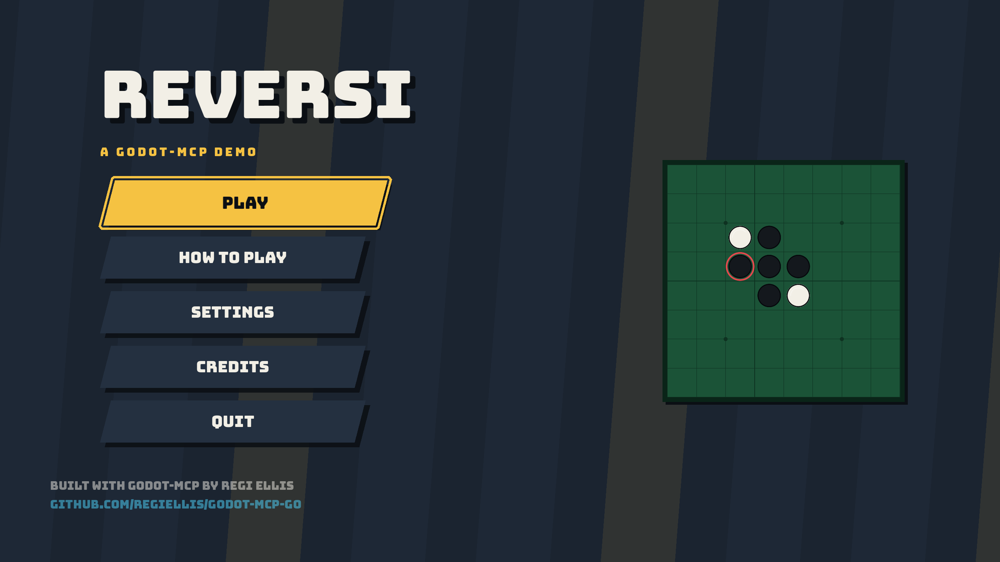
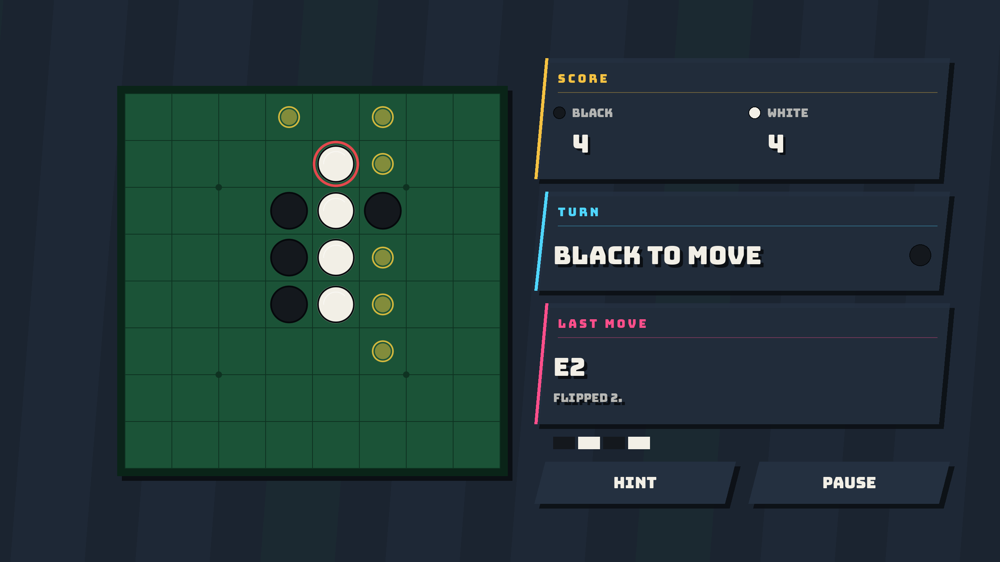
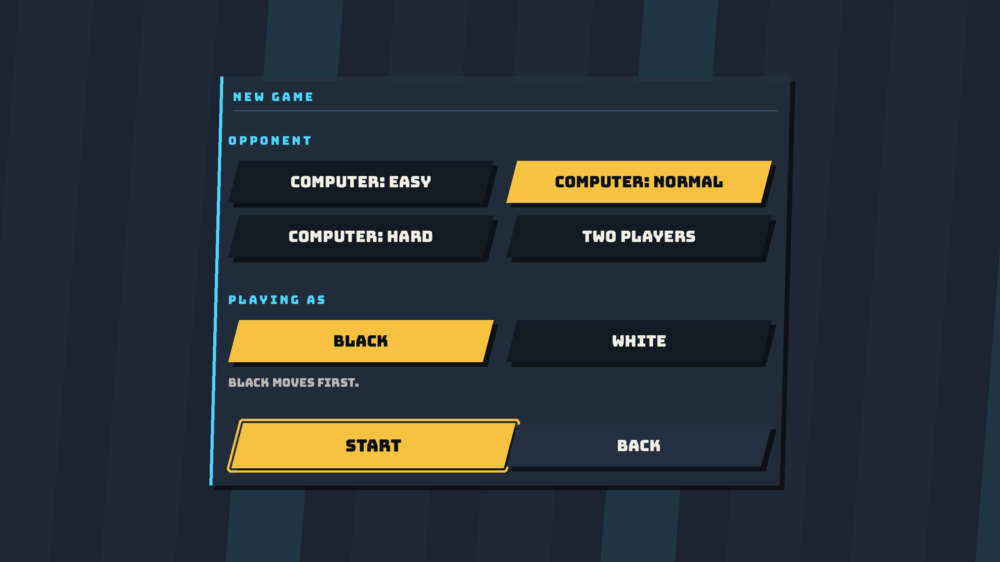
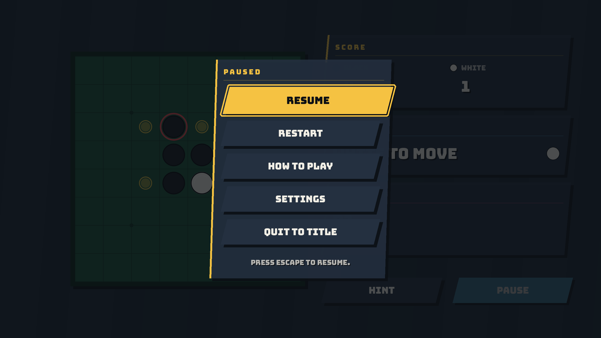
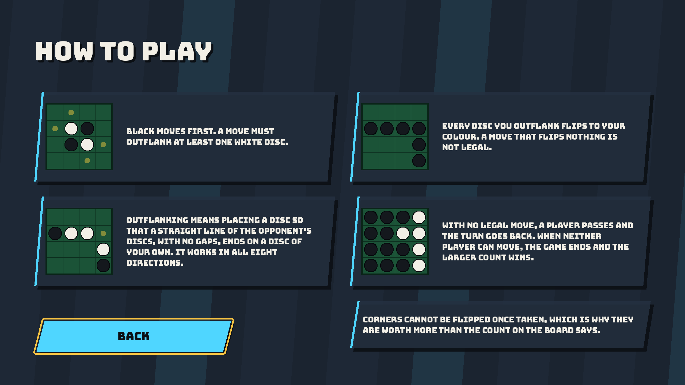
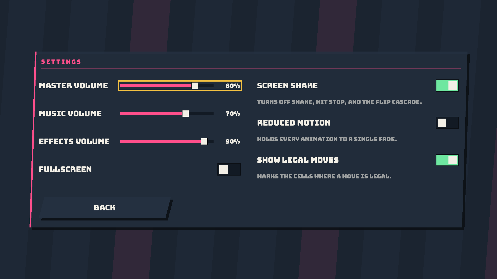
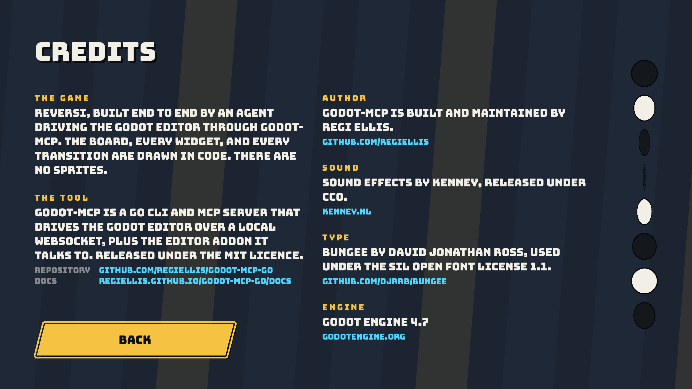

# Reversi

[](https://godotengine.org)
[](https://github.com/regiellis/godot-mcp-go)
[](LICENSE)


A complete Reversi game for Godot 4.7, built end to end by AI agents driving
[godot-mcp](https://github.com/regiellis/godot-mcp-go) against a live editor.



It exists as evidence, which is why it is a whole game rather than a scene: boot, splash, intro,
title, setup, match, pause, settings, how to play, credits and result. The game says so itself on
its first intro card.

> [!IMPORTANT]
> **This is not an argument for generating games from a single prompt, and it is not a case for
> making games at volume.**
>
> One prompt produced the brief. Everything after that took direction. The first build looked
> finished and was not: it carried spacing and overlap faults on every screen, a drop shadow that
> made small text read as doubled, and a title screen that clicked at the player once a second for
> as long as it was open. A person found all of it, and the fixes were structural rather than
> cosmetic.>
> It also worked because Reversi is a solved problem. The rules are fixed and published, the board
> is eight by eight, and the interface conventions are decades old. Nothing here had to be invented,
> prototyped, or found by playing the thing until it felt right. A brief for a game that does not
> exist yet, where the mechanic has to be discovered by iterating on it, is a different job, and one
> prompt does not touch it.
>
> This is a teaching artifact rather than a product. It is not maintained as a game and takes no
> feature requests. It is MIT licensed because the point is for people to read it, learn from it and
> reuse the techniques freely, so treat it as a worked example rather than a dependency.
>
> godot-mcp is a tool. It belongs alongside the rest of a Godot workflow rather than in place of it:
> source control, review, playtesting, and someone with the judgement to decide when a thing is
> actually done. The claim this demo makes is narrower and more useful than autonomy. An agent can
> hold a real development loop, and it can be directed, corrected and held to a standard, the same
> as any other contributor.

## Run it

```bash
git clone https://github.com/regiellis/godot-reversi
godot --path godot-reversi
```

Godot 4.7 or newer. There is nothing to install: no addons, no plugins, no build step.

Click a highlighted cell to place a disc. Escape opens the pause menu, and arrow keys with Enter
drive every menu. Play the computer at one of three depths, or two people at one keyboard.



| | |
| --- | --- |
|  |  |
|  |  |

## What it shows

There are no sprites in the game. The board, the discs, the buttons, the sliders, the panels, the
notification stack, and the screen transition are all drawn in `_draw()` out of polygons and text.
Thirty GDScript files, eleven scenes, and the only images in the repository are the project icon and
the screenshots above.

The design box is 2560 by 1440, fitted to the window by `canvas_items` stretch. Drawing everything
in code is what makes that resolution-independent: there is no bitmap to go soft when the box is
scaled to a different screen.

- **A whole game, not a single scene:** Eleven screens, wired through one `Stage` autoload that owns
  every scene change and the transition, so no screen calls `change_scene_to_file` itself.
- **The rules live in exactly one file:** `core/reversi_board.gd` is a `RefCounted` with no engine
  dependency past `Vector2i`, so the same code answers the on-board hints, the click test, and the
  opponent's search. `flips_for` is the only function in the project that walks the eight rays, and
  every legality question routes back to it.
- **An opponent at three depths:** `core/reversi_ai.gd` runs random-with-corners, then a positional
  weight table, then alpha-beta with iterative deepening under a 60 ms budget that returns the best
  move found so far when the time is spent.
- **Feel on a dial:** Screen shake, hit stop, the flip cascade, and the button springs all route
  through one `Juice` autoload with a single switch behind it. Turning it off silences what is
  already running rather than only blocking the next call, and the reduced motion setting drives the
  same switch. Toasts are deliberately exempt: they carry information such as a turn passing, and an
  accessibility setting may take away animation, not content.
- **The flip is the animation:** A disc scales to zero on X, swaps colour at the midpoint, and
  scales back, each one delayed by its distance from the placed cell so a cascade reads as a wave
  running outward. Five or more flips also earn a short shake and 70 ms of hit stop.
- **Drawn controls, because a StyleBox cannot be tweened:** Every widget keeps its state in private
  floats that tweens move and `_draw` reads, which is what lets a button squash on press and a score
  counter roll, punch, and tint back down in the same beat.
- **No hand-placed coordinates:** Every gap comes from one space ladder in `core/design.gd`,
  positions are derived from a running cursor, and a block of text is measured with
  `Design.text_height` rather than assumed to be a certain number of lines. A screen exposes its
  layout as a dictionary of boxes, and the same dictionary feeds `_draw`, the scene file, and a
  collision check, so those three cannot disagree about where anything sits.

## The brief it was built from

The whole project started from one prompt, and the prompt is not ours. It is the brief from
[One Prompt to a Complete Reversi Game](https://www.youtube.com/watch?v=D-jqmczINnQ), a demo video
by youichi-uda showing [godot-mcp-pro](https://github.com/youichi-uda/godot-mcp-pro). Credit for the
brief goes there.

This repository answers the same brief with [godot-mcp](https://github.com/regiellis/godot-mcp-go),
so the two results can be put side by side and judged on what they produced. That is the most useful
thing a demo can offer: the same starting point, two tools, and the output in the open.

The prompt is reproduced here with paste artifacts removed and nothing else changed:

```
Build a complete Reversi (Othello) game in this Godot project. Use a single
scene (main.tscn) with a single GDScript (main.gd). Draw everything with
_draw(): no sprites or textures needed.

Requirements:
- 8x8 board with dark green background, darker grid lines, dark blue-gray page
  background
- Black and white circular pieces with outlines
- Yellow semi-transparent highlights on valid moves
- Red circle indicator on last placed piece
- Standard Reversi rules: place to flip opponent pieces in all 8 directions
- Black goes first, automatic turn passing with "Pass!" message
- Flip animation: scale X 1-0-1, block input during animation
- UI: ScoreLabel (top), TurnLabel (bottom), MessageLabel (center, hidden),
  RestartButton (hidden)
- Connect RestartButton pressed signal
- Board centered with offset Vector2(160, 60), cell size 60

After building, set as main scene, reload project, and play it.

Then playtest the game yourself:
1. Take a screenshot to confirm the initial board renders correctly.
2. Play 4 moves total (alternating Black and White) by clicking valid cells
   with simulate_mouse_click. The board pixel origin is (160, 60) with 60px
   cells: click cell centers.
3. After EACH move, take a screenshot. Verify: the piece appeared, flipped
   pieces changed color, score updated, turn switched, and valid move
   highlights moved.
4. If anything looks wrong, stop the scene, fix the bug, and retest from
   scratch.
```

Three constraints in it were waived explicitly when the work was commissioned: the single scene, the
absence of sprites and textures, and a note about Godot 4.6 loop typing that does not apply to 4.7.
The instruction that replaced them was to build it like a commercial game.

Where the result departs from the brief, and why:

- **One scene became eleven:** waived at the start, and the reason the project is worth reading.
- **`ScoreLabel` and `TurnLabel` became a panel column:** The brief's board geometry left most of
  the page empty beside the board, so the score, the side to move, the last move and the move
  history live in cards to the right of it instead of as labels above and below.
- **`RestartButton` moved into the pause menu:** where a restart belongs once a game has one.
- **The board geometry survived unchanged until the first review:** Origin `(160, 60)` with 60px
  cells was load-bearing, because the playtest clicks cell centres by pixel. Moving to 1440p doubled
  it to `(320, 240)` with 120px cells, which is the same fraction of the page.

## What review changed

The project went through two rounds of review by its maintainer. The first is recorded here because
what it caught is the point of the demo: the first build looked finished and was not.

### First review

1. **Make the game 1440p.**
2. **There are spacing and overlapping UI issues on every screen.**
3. **Nothing lists the author, the repository, or the documentation for the tool.**

The first point was mechanical. The second was not: the cause was that every screen had been laid
out from a hand-written list of pixel coordinates, and that list contained arithmetic errors. Fixing
the coordinates would have preserved the way of working that produced them, so the layout system
replaced them instead. Positions are now derived, text is measured, and a build-time audit refuses
to save a scene containing an overlap, an off-page element, a broken page margin or a zero-sized
control. That audit immediately caught a button row running past the bottom of the page and two
screens that no longer fitted in one column at the larger size.

The third point produced the `AUTHOR` section on the credits screen, the labelled `REPOSITORY` and
`DOCS` links beside it, and the two-line footer on the title screen.



### Second review

Publish it: say what the demo is, publish the brief it came from and the review that shaped it, add
a licence file and version badges, and launch it as its own repository.

## How it was built

One controlling agent planned the work and verified it. Subagents did the building, all of them
driving the same live Godot editor through godot-mcp: research agents read the reference material
first, then implementation agents wrote the code and built the scenes.

Scenes are built by a script that constructs the tree, packs it and saves it, rather than by opening
each scene in the editor. A Godot editor has one current scene, so several agents opening scenes at
once would quietly overwrite each other's work.

The playtest in the brief was run as written and then again after the 1440p change. Four alternating
moves were clicked at real cell centres, and after each one the score, the side to move, the last
move and the set of legal-move markers were read back out of the running game and checked. A
screenshot alone cannot tell a correct board from a plausible one.

The whole thing took about two hours and fifty minutes of wall clock, measured from the first editor
session on an empty directory. Roughly seventy minutes of that reached the first playable,
playtested build; the rest went on the two review rounds above and the rework they caused. Agents
ran in parallel throughout, so that is elapsed time and not a measure of effort.

## Where this repository comes from

> [!NOTE]
> **This repository is a one-way public mirror.** The game is developed as a worked example inside
> [godot-mcp-go](https://github.com/regiellis/godot-mcp-go), under `samples/reversi/`, and published
> here as a snapshot. It shares no commit history with the development repo, so **pull requests
> cannot be merged directly**. For bugs, feature requests or changes, please open an
> [Issue](../../issues). That is where the work is tracked.

## Credits and licence

The game, the widget kit, and the board renderer were written for this project and are MIT licensed.
See [LICENSE](LICENSE). The bundled assets keep their own terms, recorded in [NOTICE](NOTICE).

**The people credited below are not associated with this project and have not endorsed it.** Their
work is used under licences that permit reuse. A CC0 release, an OFL font, or an MIT kit grants
permission to use the work: it says nothing about the author's view of AI tools, of AI in games, or
of this demonstration. Do not read their presence in these credits as support for any of it.

The look and feel of the interface come from the
[Liquid UI Kit for Godot](https://miisan.itch.io/godot-4-ui) by **Miisan**. Every widget here draws
itself in `_draw()` so that each property stays a float a tween can move, which is their idea, and
it is why a button can squash on press and a score counter can roll, punch and settle in one beat.
The mechanisms were re-implemented against this game's own design tokens rather than vendored, but
the thinking is theirs. It is MIT, it is free, and it is worth your time.

Sound effects are by [Kenney](https://kenney.nl), released under CC0. The files and their licence
note are in `assets/audio/sfx/`.

The display face is [Bungee](https://github.com/djrrb/Bungee) by David Jonathan Ross, used under the
SIL Open Font License 1.1. The full licence text ships alongside it in `assets/fonts/OFL.txt`.

godot-mcp is built and maintained by Regi Ellis.
[Repository](https://github.com/regiellis/godot-mcp-go) and
[documentation](https://regiellis.github.io/godot-mcp-go/docs).

Built with [Godot Engine](https://godotengine.org) 4.7.
