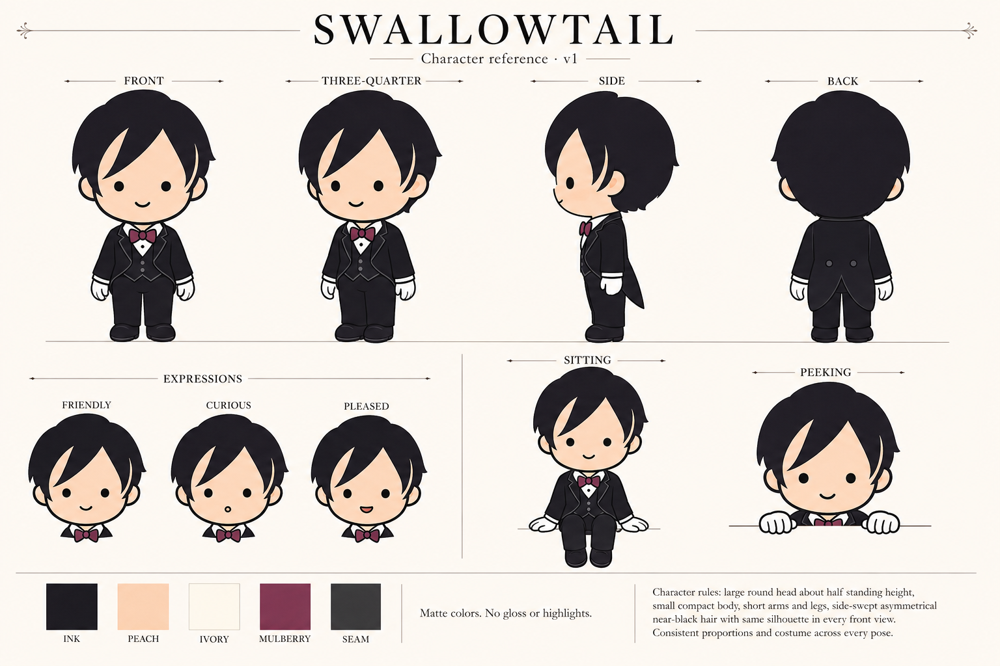

# Swallowtail character reference

Working reference created 2026-09-06 with built-in image_gen. Side and back views are proposed reconstructions; the existing homepage assets remain the reference for established poses. This sheet is a design asset, not a homepage section.

## Keep consistent

- Friendly chibi butler with a large round head, compact body, short limbs, and rounded shoes.
- Asymmetrical side-swept near-black hair, peach face, black dot eyes, simple small mouth.
- Near-black tuxedo and trousers, white pointed collar and gloves, mulberry bow tie with a round knot.
- Matte hair, clothes, and shoes. No shine ribbons, glossy spots, rim lights, or added glow. Use restrained seam outlines.
- Preserve the hair part and costume across poses. Expressions stay simple; avoid detailed eyes or added facial features.
- Match colors to the original reference assets; sheet swatches are visual guidance rather than exact color specifications.
- Export individual website poses with true PNG alpha transparency, never a painted checkerboard. Keep intended contact points aligned with the actual CSS edge.

## Recreate a pose

Attach this sheet plus the closest existing pose. Describe only the new action, viewpoint, canvas, and contact points. Explicitly request the same proportions, costume, hair silhouette, palette, and matte finish. Inspect the result against the established assets before use.

References: ../public/brand/swallowtail-butler.png, ../public/brand/swallowtail-sitting.png, ../public/brand/swallowtail-peeking.png.

## Generation prompt

Create a polished production CHARACTER REFERENCE SHEET for "Swallowtail", the friendly chibi butler mascot in the supplied reference images. Use first image for face and hair identity, second image for matte full-body costume and seated pose, third for peeking pose. This is a coherent reference sheet of ONE consistent character, not a redesign. Landscape large canvas, warm ivory background #faf6ef, thin muted rules, generous spacing, tidy readable typography in dark ink. Title "SWALLOWTAIL" and small subtitle "Character reference · v1". Top row labeled FRONT, THREE-QUARTER, SIDE, BACK: four full-body standing turnarounds at identical scale, aligned head/feet baselines. Back and side are proposed reconstructions consistent with the front, simple black tailcoat with split tails, no extra accessories. Lower left: three face expressions labeled FRIENDLY, CURIOUS, PLEASED (round black dot eyes, small simple mouths; no anime sparkle, nose, eyebrows or blush). Lower center/right: two full-body/partial poses labeled SITTING and PEEKING, matching references; sitting with white palms resting beside hips and feet dangling, peeking with white gloves hooked over a thin illustrative rule. Small bottom strip with five color swatches and names INK, PEACH, IVORY, MULBERRY, SEAM; do not print hex numbers. Beside swatches exact note "Matte colors. No gloss or highlights." Character rules: large round head about half standing height, small compact body, short arms and legs, side-swept asymmetrical near-black hair with same silhouette in every front view, peach skin, two black dot eyes, tiny friendly smile, white pointed collar, mulberry bow tie with round central knot, near-black tailored jacket and trousers, white gloves, rounded matte black shoes. FLAT SOLID COLORS, no gradients on hair, no reflective streaks on shoes or clothes, no rim lighting, no glow, no shadows behind figures. Subtle thin charcoal seam lines only. Consistent proportions and costume across every pose. No terminal prop. All figures fully visible and comfortably separated.

